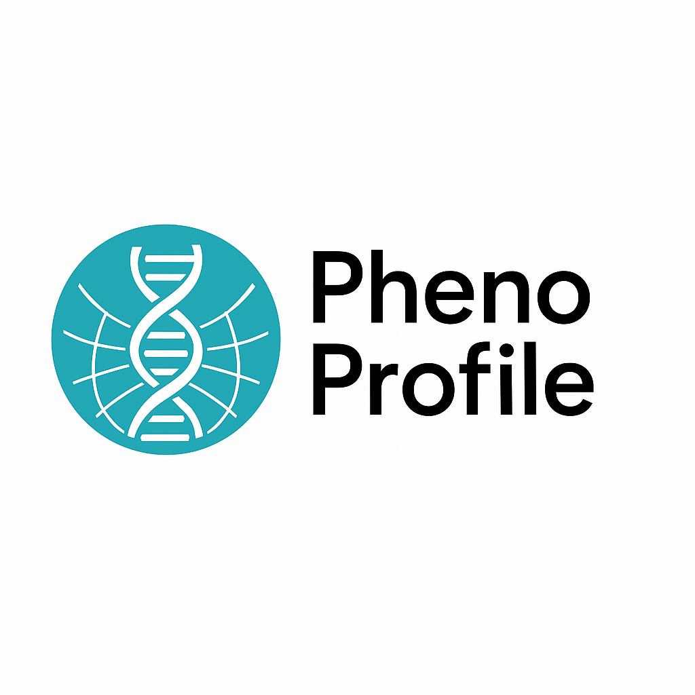
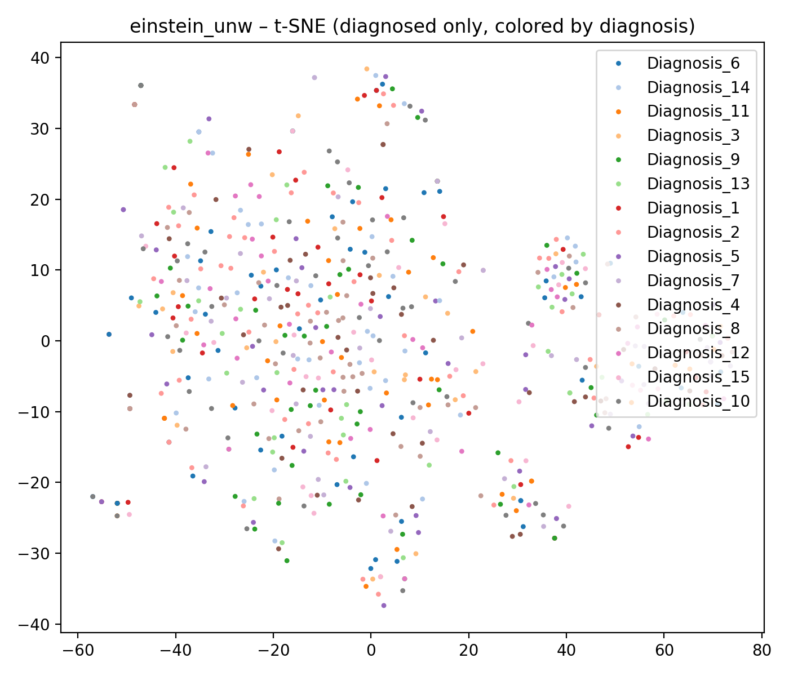
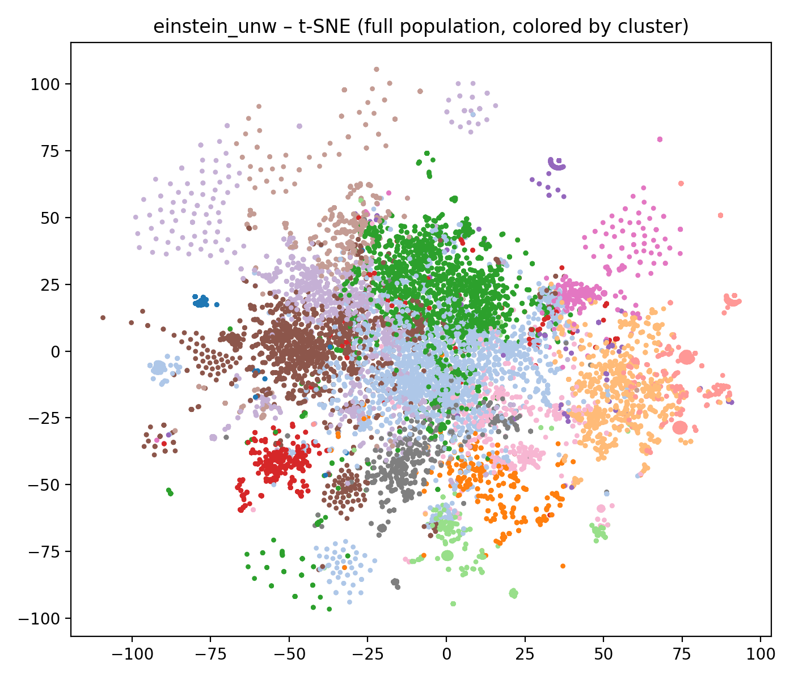
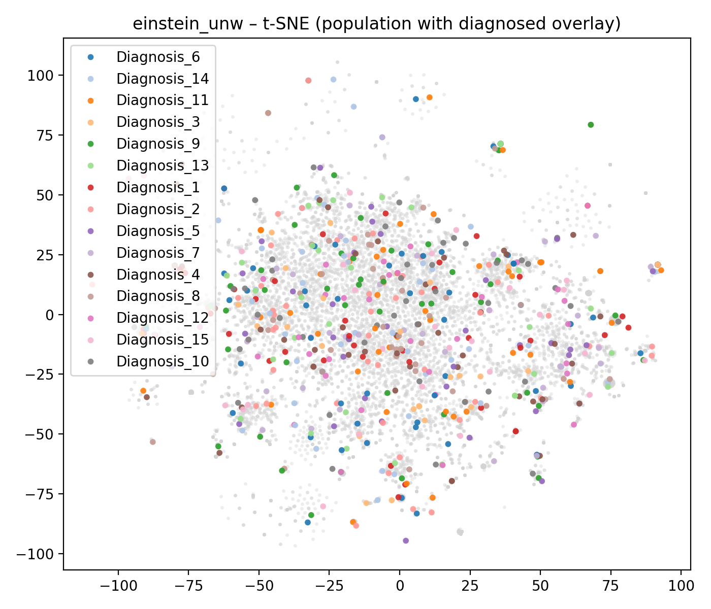

[](./CITATION.cff)

<p align="center">
  
</p>
<h3 align="center">Patient Phenotypes Embeddings</h3>

<br>


This project provides a complete pipeline for learning dense patient embeddings from a binary patient × HPO phenotype matrix, using multiple embedding methods:

* Hyperbolic embeddings (Fréchet mean, Einstein midpoint)

* Linear factorization (Truncated SVD, NMF)

* Non-linear autoencoder

* Optional: hybrid methods (planned)

The goal is to compare how different mathematical representations capture phenotypic similarity across patients, and how well these representations align with ground-truth diagnoses.

## 🌳 Project structure

```
project/
│
├── data/
│   ├── binary_matrix.csv              # Patient × phenotype binary matrix
│   ├── diagnosis_synthetic.csv        # Synthetic patient diagnoses (generated)
│   ├── hpo_embeddings.npy             # Precomputed HPO hyperbolic embeddings
│   ├── embeddings_metadata.pkl        # Contains metadata, including ordered HPO IDs
│   └── [...]                          # Other data files
│
├── output/
│   ├── patient_embeddings_all_methods.npz   # Final consolidated embedding file
│   ├── patient_embedding_stats.csv          # Stats describing embeddings
│   ├── evaluation_results.csv               # Cluster evaluation metrics
│   ├── plots/
│   │   ├── tsne_frechet_unw.png
│   │   ├── tsne_einstein_unw.png
│   │   └── ... (t-SNE visualizations)
│   └── [...]
│
├── scripts/
│   ├── compute_patient_embeddings_all_methods.py   # Generates all embeddings
│   ├── evaluate_patient_embeddings.py               # Evaluates clustering vs diagnosis
│   ├── train_patient_autoencoder.py                 # Trains AE + stores embeddings
│   ├── generate_synthetic_diagnosis_file.py         # Creates fake diagnosis file
│   └── [...]
│
└── README.md
```

## 🧩 Core Concepts

### 1. Patient × Phenotype Matrix

The project starts from a CSV where:

* Rows = patients

* Columns = HPO codes

* Values = 1/0 (phenotype present/absent)

The matrix is automatically aligned with the HPO embeddings using metadata["hpo_ids"] (the first column of the CSV should be IDs)


### 2. HPO Hyperbolic Embeddings

Using a pretrained HierarchyTransformers hyperbolic model, each phenotype has a dense embedding in the Poincaré ball. These embeddings encode:

* hierarchical depth

* semantic similarity

* taxonomic relationships

### 3. Patient Embeddings

For each patient, we derive a dense embedding using:

#### Data-driven approaches

Linear and non-linear methods using only the binary Patient × Phenotype matrix.

* Truncated SVD
* NMF (Non-negative Matrix Factorization)
* Autoencoder

#### Knowledge-based approaches

Non-linear method based on HPO hyperbolic embeddings applied to the binary Patient × Phenotype matrix. 

As a result, a patient phenotypic profile is an aggregation of his phenotypes embeddings. 
In hyperbolic geometry, this aggregation is typically done through Fréchet mean or Einstein midpoint (which is a good approximation to scale up).

Unweighted methods treat each phenotype equally, while IC (Information-Content) methods weight each phenotype based on its relative discriminative importance within all the patients.

* Fréchet mean (unweighted)
* Einstein midpoint (unweighted)
* Fréchet mean (IC-weighted)
* Einstein midpoint (IC-weighted)

All resulting embeddings are stored in a single file:
```text
output/patient_embeddings_all_methods.npz
```

### 📐 Mathematical Definitions

#### Fréchet Mean

Given points $x_1, x_2, \dots, x_n$ on a Riemannian manifold $(\mathcal{M}, g)$ and non-negative weights $w_i$ such that $\sum_{i=1}^{n} w_i = 1$, the Fréchet mean is the minimizer of the weighted squared geodesic distances:

$$
\mu^\* = \arg\min_{m \in \mathcal{M}} \sum_{i=1}^{n} w_i \ d(m, x_i)^2
$$

where $d$ is the geodesic distance on the manifold (= hyperbolic distance in the Poincaré ball).

In practice, the Fréchet mean is computed via Riemannian gradient descent:

$$
m_{t+1} = \exp_{m_t} \Bigg(-\eta_t \sum_{i=1}^{n} w_i \ \log_{m_t}(x_i) \Bigg)
$$

where:

- $\log_{m_t}(x)$ is the logarithmic map at $m_t$,
- $\exp_{m_t}(.)$ is the exponential map at $m_t$,
- $\eta_t$ is the learning rate.

This is the hyperbolic analogue of the Euclidean centroid.


#### Einstein Midpoint

Hyperbolic geometry uses **Möbius addition**.  
In the Poincaré ball model with curvature $c > 0$, it is defined as:

$$
x \oplus_c y =
\frac{
(1 + 2c\langle x,y\rangle + c\|y\|^2)\,x
+
(1 - c\|x\|^2)\,y
}{
1 + 2c\langle x,y\rangle + c^2\|x\|^2\|y\|^2
}
$$

Given points $x_1, \dots, x_n$ with positive weights $\alpha_i$, the **Einstein midpoint** (also called the gyrocenter or hyperbolic weighted midpoint) is:

$$
m =
\frac{
\sum_{i=1}^{n} \gamma_{x_i} \, \alpha_i \, x_i
}{
\sum_{i=1}^{n} \gamma_{x_i} \, \alpha_i
}
$$

with Lorentz factor:

$$
\gamma_x = \frac{1}{\sqrt{1 - c\|x\|^2}}.
$$

Points closer to the boundary of the ball (larger norm) have higher $\gamma_x$, which gives more influence to *specific* or *deep* phenotypes.

The Einstein midpoint is a **fast closed-form approximation** of the Fréchet mean in hyperbolic space, which is useful for large dataset.


## 🧪 Evaluation Workflow

This evaluation pipeline allows to assess:

* How well embeddings preserve diagnosis-related structure
* Whether embeddings produce clear intrinsic clustering
* How diagnosed patients integrate into the global population manifold

Together, these metrics and visualizations give a comprehensive, clinically meaningful assessment of patient phenotype embeddings.

### 1. Diagnosis-based clustering performance

We measure how well the embedding space organizes patients with known diagnoses.

We use KMeans with k = number of diagnosis classes and compute:

* **Adjusted Rand Index (ARI)**:
Measures agreement between clusters and diagnosis labels
(0 = random, 1 = perfect match).

* **Normalized Mutual Information (NMI)**:
Measures shared information between cluster assignments and diagnoses
(0 = no relation, 1 = perfect correlation).

These metrics reflect whether the embedding space captures medically meaningful phenotype similarity.

### 2. Intrinsic clustering quality (diagnosis-free)

To evaluate the geometric structure of the embedding without relying on diagnoses:

* **Silhouette score**:
Measures cohesion vs. separation
Higher = better defined clusters.

* **Davies–Bouldin index**:
Measures how overlapped clusters are
Lower = better clustering.

These describe how “clusterable” the embedding is on its own.

### 3. Visual inspection

Because clinical data is complex, visualization is crucial.
For each embedding method, we generate three t-SNE plots, each highlighting different properties of the manifold:

**(A) Diagnosis-Only Manifold**

```
output/plots/tsne_<method>_diag_only.png
```

<p align="center">
  
</p>

* t-SNE applied only on diagnosed patients
* Points colored by diagnosis
* Shows whether diagnoses naturally form coherent phenotypic groups
* Useful for evaluating diagnosis heterogeneity

**(B) Full Population: Cluster View**

```
output/plots/tsne_<method>_full_clusters.png
```

<p align="center">
  
</p>

* t-SNE applied on all patients
* Points colored by KMeans cluster assignments
* Shows how the global patient population organizes in the latent space

**(C) Diagnosis Overlay on the Full Population Manifold**

```
output/plots/tsne_<method>_pop_with_diagnosis.png
```

<p align="center">
  
</p>

* t-SNE on all patients, plotted in light grey
* Diagnosed patients overlaid in color
* Reveals how diagnoses sit inside the full population structure
* Shows:
  * whether diagnosis groups correspond to dense phenotypic regions
  * how undiagnosed patients surround known diagnostic clusters
  * potential phenotype-based diagnosis propagation paths


## 🛠 How to Run the Pipeline

### Step 1: Compute all embeddings

```
python scripts/compute_patient_embeddings_all_methods.py
```

This:

* Loads binary matrix
* Loads HPO embeddings
* Aligns columns
* Computes 6 patient embedding methods (all except autoencoder)
* Stores everything into a single ``patient_embeddings_all_methods.npz`` file
* Generates statistics written to ``patient_embedding_stats.csv``

### Step 2: Train Autoencoder

```
python scripts/train_patient_autoencoder.py
```

This:

* Trains a 64-dimensional nonlinear autoencoder (latent dimension can be changed in the script)
* Adds "autoencoder" to the same ``patient_embeddings_all_methods.npz`` file

### Step 3: Generate synthetic diagnoses (optional) 

If real diagnoses are not available:

```
python scripts/generate_synthetic_diagnosis_file.py
```


This creates:

```
data/diagnosis_synthetic.csv
```

### Step 4: Evaluate embeddings

```
python scripts/evaluate_patient_embeddings.py
```

This:

* Loads the ``patient_embeddings_all_methods.npz`` file
* Loads diagnosis file
* Clusters each embedding (k=number of diagnoses)
* Computes ARI, NMI, silhouette, DB index
* Generates t-SNE visualizations

Writes results to:

```
output/evaluation_results.csv
```

## 📜 License & Usage

This project is released under an **All Rights Reserved – Research Use Only** license.

You may use, view, and modify the code for **non-commercial academic research**.  
Redistribution and commercial use are **not permitted** without prior written consent.

For details, see the [LICENSE](LICENSE) file.

## 📚 Citation

```bibtex
@misc{pheno_profile_2025,
  author       = Labbé T.,
  title        = {Pheno Profile: Hyperbolic and Euclidean Patient Phenotypes Embeddings},
  year         = {2025},
  publisher    = {GitHub},
  journal      = {GitHub repository},
  howpublished = {\url{https://github.com/labbeth/phenoProfile}}
}
```

## ⚠️ Disclaimer

This repository is intended **for research only**.

- It is **not** a medical device.
- It must **not** be used for clinical decision-making, diagnosis, or
  patient management.
- All experiments should be run on **de-identified data**, in compliance
  with your local ethical and legal regulations (GDPR, HIPAA, etc.).

The authors accept no responsibility for any misuse of this code.
